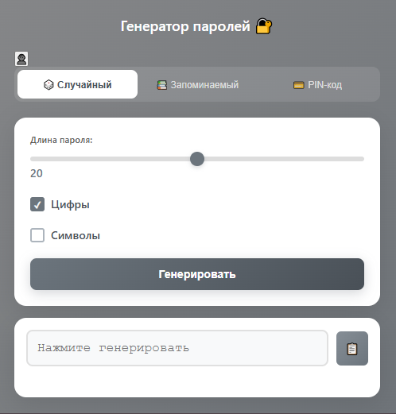

# chrome-extension-make-password
Генератор паролей в Chrome

<!-- # Генератор паролей в Chrome -->

Простое расширение для Chrome генерации безопасных паролей различных типов.

## Возможности
- Настраиваемый сложный пароль
- Генерация запоминаемого пароля из английских слов
- Генерация пин-кодов
- Копирование в буфер обмена

## Поддержка языков
- Русский

> ©2025 Филюшин Дмитрий. Licensed under [MIT license](https://github.com/DFilyushin/chrome-extension-make-password/blob/main/LICENSE)
